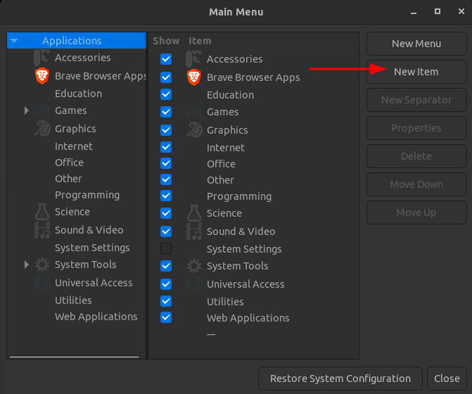
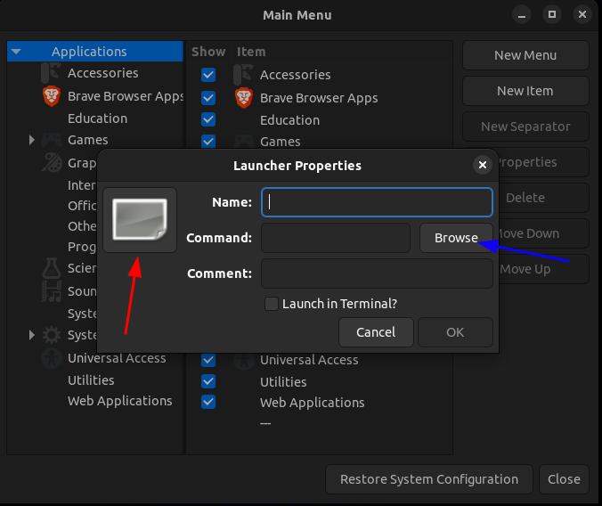

# Robotics Competition - RoME 26

## Pre-requisites

- Ubuntu 22.04 LTS 
- ROS2 Humble
- Ignition Gazebo Fortress
- Groot
- BT.cpp

#### NOTE: This will not work if you are using WSL or a virtual machine, it is recommended that you dual boot if you are usually using Windows as your operating system. 

## Installing ROS2 Humble

Instructions are available [here](https://docs.ros.org/en/humble/Installation/Ubuntu-Install-Debs.html).

## Installing Ignition Gazebo Fortress

Instructions are available [here](https://gazebosim.org/docs/fortress/install_ubuntu/).

## Installing Groot

You can install an AppImage [here](https://www.behaviortree.dev/groot/)

Afterwards, don't forget to make it executable via 
```sh
chmod +x <path/to/Groot2.AppImage>
```

If you want to make the app available in your desktop, the recommended solution is through alacarte:
```sh
sudo apt install alacarte
```
Once you open alacarte, use the button marked with the red arrow to create the app. 



Then, use the logo provided below at the button indicated with the red arrow, and select the Groot2 AppImage at the browse button indicated with the blue arrow.



####### Logo: 


